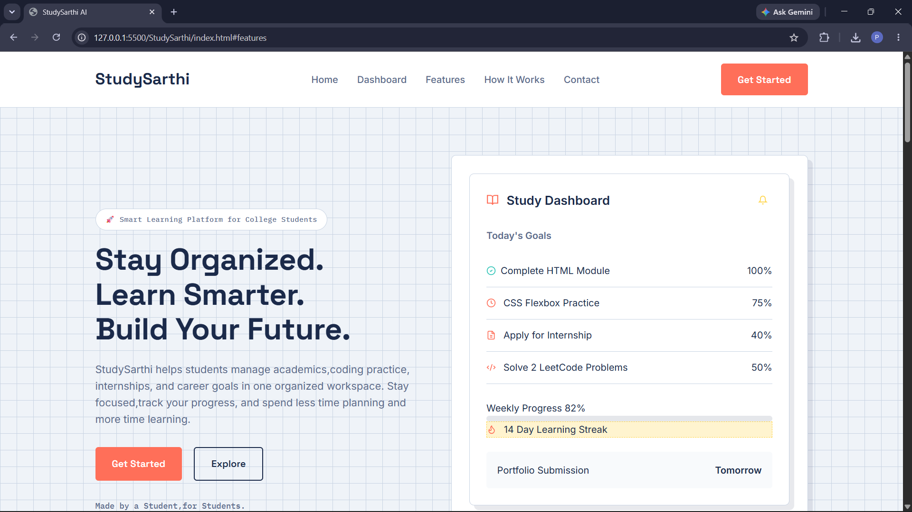
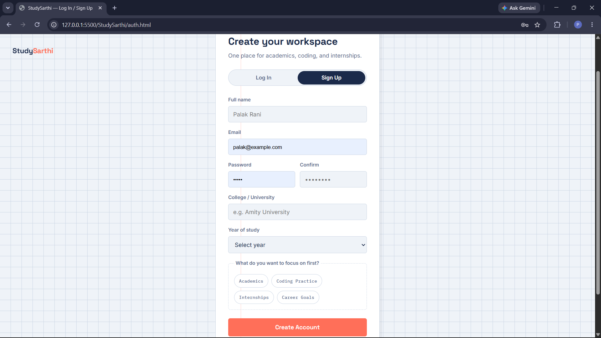
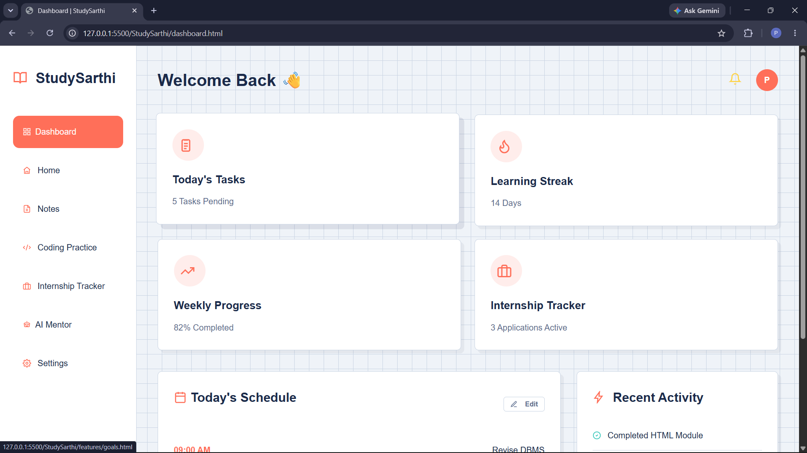
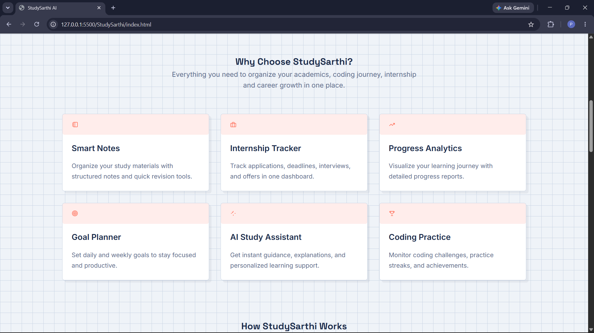
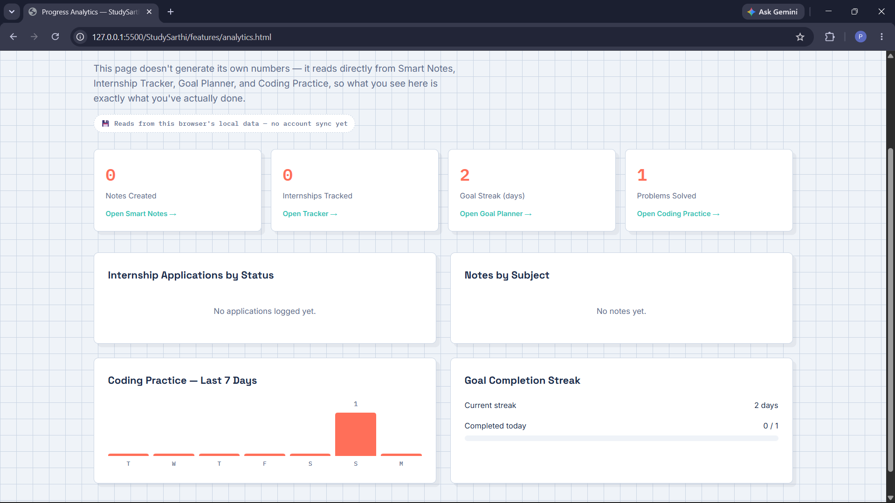

# StudySarthi





**An all-in-one student workspace** — notes, internship tracking, coding practice, goal planning, and progress analytics in one place, so you stop losing time switching between five different apps.

🔗 **Live demo:** [study-sarthi.vercel.app](https://study-sarthi.vercel.app)

---

## Why I built this

Between tracking internship applications in one app, notes in another, and coding practice somewhere else entirely, I was spending more time managing tools than actually studying. StudySarthi is my attempt to fix that for myself — and to build something real enough to show for it.

This is a **solo project**, built as both an internship deliverable and a portfolio piece. It's a work in progress, and this README is deliberately honest about what's actually working versus what's still planned — I'd rather you find that out here than discover it yourself and wonder what else isn't disclosed.

---

## What's actually working right now

These tools are fully functional — not mockups. They read and write real data via the browser's `localStorage`, so your data persists across page reloads (though not yet across devices — see [Known Limitations](#known-limitations) below).

| Feature | What it does |
|---|---|
| 📝 **Smart Notes** | Create, edit, delete, tag, and search notes by subject |
| 💼 **Internship Tracker** | Log applications with status (Applied/Interview/Offer/Rejected), deadlines, and notes — sorted by urgency, with overdue flagging |
| 🎯 **Goal Planner** | Set daily/weekly/one-time goals, check them off, and track a real day-streak computed from your actual completion history |
| 💻 **Coding Practice** | Log solved problems by platform and difficulty; tracks a real streak and weekly count |
| 📊 **Progress Analytics** | Aggregates real data from the four tools above into charts — no fabricated numbers, it's your actual activity |
| 📅 **Learning Streak Calendar** | A GitHub/LeetCode-style contribution heatmap showing your real activity history, longest streak, and streak-break history |
| ⚙️ **Settings** | Profile, appearance, notification, and study preferences, saved locally |

## What's an honest preview (not the real thing yet)

| Feature | Current state |
|---|---|
| 🤖 **AI Study Assistant** | A **rule-based keyword-matching chatbot**, not a real language model. It gives genuinely useful canned responses (study techniques, motivation, quiz-me format) and is clearly labeled as a preview. A real LLM-powered version is planned. |
| 🔐 **Login / Signup** | A fully designed, working frontend flow — but there's **no real backend authentication yet**. Session state is currently simulated with `sessionStorage`/`localStorage` to demonstrate the intended UX (first-time visitors see Signup, returning visitors see Login, active sessions skip straight to the dashboard). Real auth via Firebase or Supabase is the next major milestone. |

---

## Tech stack

- **HTML / CSS / vanilla JavaScript** — no framework, no build step
- **`localStorage`** for all current data persistence (no backend yet)
- **Lucide-style inline SVG icons** — no icon font dependency
- **Google Fonts:** Space Grotesk (display), Inter (body), IBM Plex Mono (data/stats)
- **Deployed on Vercel**

## Design

The visual theme ("Student Notebook") is intentional, not a template default — graph-paper background, hard-edged index-card shadows, a coral/teal/highlighter-yellow palette, and a subtle "notebook margin rule" on key pages. The goal was something that feels like the product's own world (studying, notebooks) rather than generic SaaS-purple-gradient styling.

---

## Project structure

```
StudySarthi/
├── css/
│   ├── style.css          # shared design tokens, base layout, homepage sections
│   ├── dashboard.css      # dashboard layout + cards
│   ├── settings.css       # settings page
│   └── responsive.css     # mobile/tablet breakpoints — required by every page
├── js/
│   ├── streak-utils.js    # shared streak-calculation logic (Goal Planner + Coding Practice)
│   ├── dashboard.js
│   └── settings.js
├── features/
│   ├── notes.html
│   ├── internship-tracker.html
│   ├── goals.html
│   ├── coding-practice.html
│   ├── analytics.html
│   └── ai-assistant.html
├── index.html
├── dashboard.html
├── settings.html
├── auth.html
├── streak-history.html
├── about.html
├── contact.html
├── terms.html
├── privacy.html
├── help-support.html
└── README.md
```

---

## Known limitations

Being upfront about these so nothing here is a surprise:

- **No account sync across devices.** All data lives in your browser's `localStorage`. Clearing browser data, switching browsers, or switching devices means starting fresh.
- **No real backend.** Login/signup, contact forms, and the help/support form don't send data anywhere — form submissions are logged locally as a placeholder for the real thing.
- **AI Assistant is rule-based**, not a real language model (see above).

## Roadmap

- [ ] Real authentication (Firebase or Supabase)
- [ ] Move core data (notes, goals, internships, coding log) to a real database
- [ ] Genuine LLM-powered Study Assistant
- [ ] Real contact/help form submission handling
- [ ] Continued accessibility and mobile polish

---

## Running it locally

No build tools required — it's static HTML/CSS/JS.

```bash
git clone https://github.com/Palak767/StudySarthi.git
cd StudySarthi
# open index.html directly, or serve it locally, e.g.:
npx serve .
```

---

## Author

Built and maintained by **Palak Rani** — student developer, building this as an internship project and portfolio piece.

- GitHub: [@Palak767](https://github.com/Palak767)
- Live site: [study-sarthi.vercel.app](https://study-sarthi.vercel.app)

---

*This project is under active development. Feedback and suggestions are welcome via the [Help & Support](https://study-sarthi.vercel.app/help-support.html) page.*
